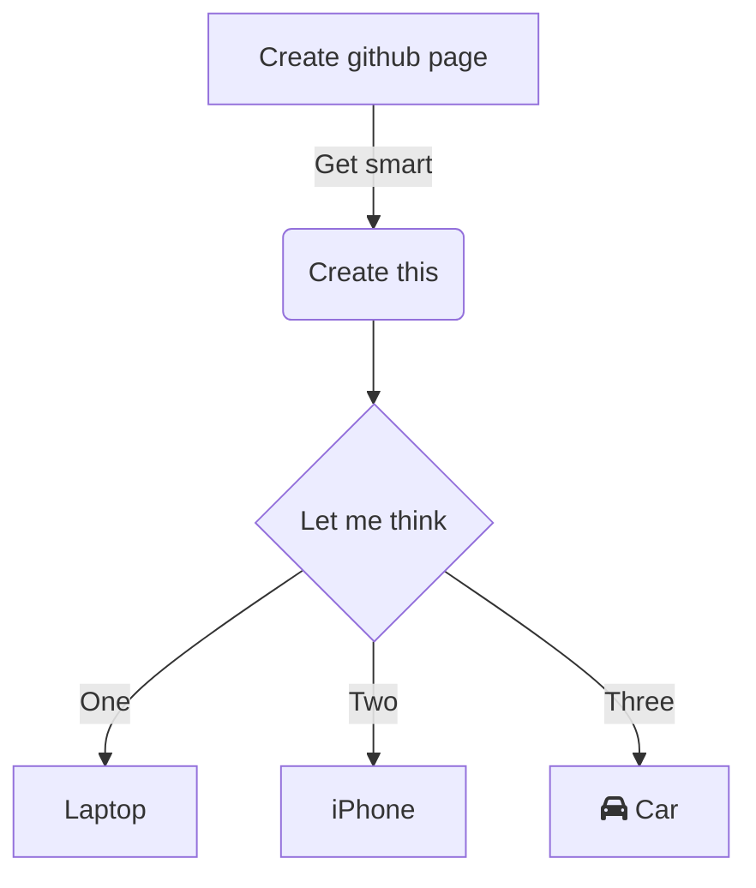

---
tags:
  - business
  - glossary
  - meanings
  - notes
---
Cost: how much a business pays for a good/service ^cost

Price: how much a customer pays for a good/service

Cost leadership: having the lowest [costs](Business%20Glossary%20(READ%20ONLY).md#^cost) in the industry

Economies of scale: the amount of a product/good/service a business can produce for the same [cost](Business%20Glossary%20(READ%20ONLY).md#^cost), leading into decrease of [cost](Business%20Glossary%20(READ%20ONLY).md#^cost)/item ^economiesofscale

Products: goods or services ^products

Product Differentiation: distinguishing [products](Business%20Glossary%20(READ%20ONLY).md#^products) in some way from a business's competitors ^productdifferentiation

Quality: How well designed, made and functional [products](Business%20Glossary%20(READ%20ONLY).md#^products) are, and the degree of competence ^quality

Development: coming up with and screening of ideas as well as identifying the commercial aspects (marketing, product launch, forecasting etc.) ^development

