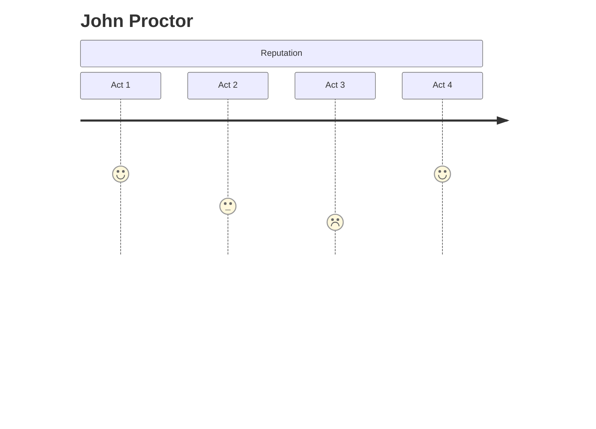
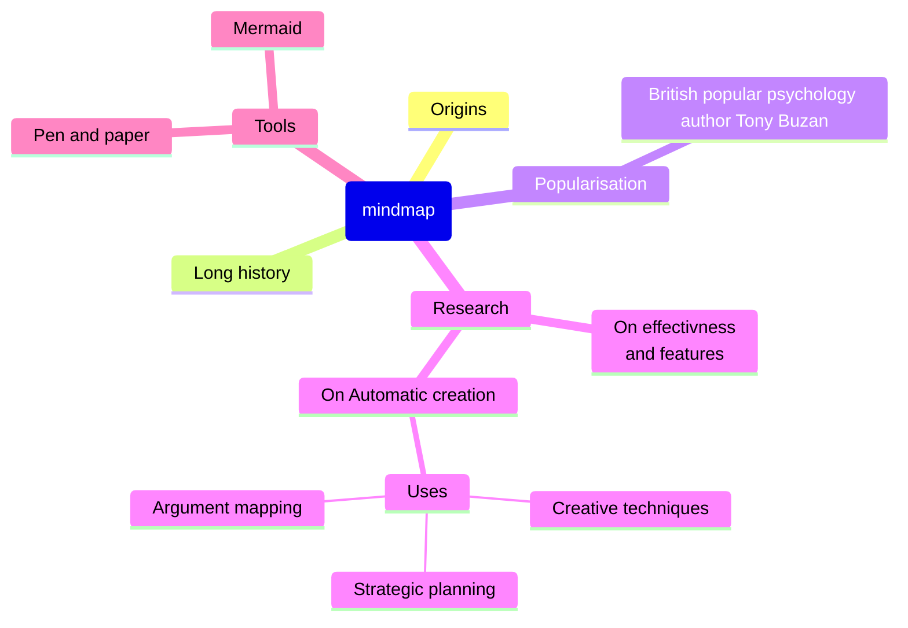

---
tags:
  - crucible
  - english
  - maths
  - mathematics
  - calculus
---

# Maths
## Differentiating trig
Proving $\frac{d}{dx}\sin{x}=\cos{x}$

# English
Cont. from [[Nov 09, 2023#Freedom or control]]
## Slideshow notes
### Danforths confidence
- The judge, Danforth, believes that he can clearly see the truth. Miller uses *dramatic irony* to challenge the assumption that humans can always see the truth clearly. The audience knows that he is being deceived by Abigail and the girls
	- Dramatic irony is the audience knowing something but the characters don't
- Danforth: "This is a sharp time, now, a precise time - we live no longer in the dusky afternoon when evil mixed itself with good and befuddled the world."
### Elizabeth's Lie
- Elizabeth is placed in a *moral dilemma*. She is forced to choose between exposing her husband's sin to an unjust and wicked community OR lying and committing perjury
	- A dilemma is where you must choose between two equally undesirable options
	- Will Elizabeth tell the truth and ruin her husband, or ruin herself and lie?
- The dilemma challenges our assumptions about easy choices between a **binary** of good and evil
### Proctor's Confession
- Finally, all the pretence is stripped away and Proctor fully accepts his **guilt** and sin. And he is also accepting his death and judgement. In doing this, he also sees the judgement coming on Salem
	- This is almost a climax point in the play
- "A fire, a fire is burning! I hear the boot of Lucifer, I see his filthy face! And it is my face, and yours, Danforth! ... you know in all your black hearts that this be fraud - God damns our kind especially, and we will burn, we will burn together"
	- Proctors judgement on Salem/Danforth
### Drama and Reflection
- Miller uses this climax in the play to prompt the audience to reflect. We know how Proctor feels, but does Danforth know that the witch trials are a fraud?
- *Ambiguity* is where there is doubt about what is true or false. We are never told if Danforth believes in the trials. Is Proctor right about Danforth? Leaving this question *ambiguous* prompts reflection in the audience
	- Does Danforth believe in the trials??
### The final dilemma
- Miller continues to challenge the audience to reflect by presenting them with the **final dilemma**:
	- Hale argues that Proctor should lie, confess to being a witch, and save his own life
		- Hale is saying the hunts are a lie, that Proctor should follow it
	- Elizabeth supports him whatever he chooses because "Only be sure of this, for I know it now: Whatever you will do, it is a good man does it"
		- Tied in with foreshadowing earlier, Proctor saying whatever you see in me see a good man
		- I know it now, not known from before, Elizabeth has changed her view on Proctor
### Proctor's Choice
- The difficulty of the dilemma is represented by Proctor vacillating
	- vacillating: moving from one side to the other
- He finally chooses, *symbolically* tearing up his confession
	- His name on the confession means him, if John wrote it, John can't put his name to the confession
- This choice emphasises the importance of removing **pretence** and being **truthful**
	- We are given binary throughout the play, then at the end it is an ultimate binary choice; lie and live, or truth and die
### Proctor's Redemption
- Proctor's arc concludes with him bravely facing his death and joining with noble and honest characters like Rebecca Nurse
- He finds forgiveness and redemption with his wife who ends the play by saying "he have his goodness now. God forbid I take it from him."
- Years later, Miller would write the screenplay for the film and add a scene where the guilty say the Lord's Prayer, suggesting a spiritual redemption.
	- this is film only, don't mention in essay

### The Puritans
- Historical context: settlers of America deeply committed to religion
- Miller's state direction/introduction: "They were united from top to bottom by a commonly held ideology"
- Collective experience determined by ideology or religious belief
- Image: unity throughout the society from "top to bottom"
### Human emotion: belonging
- Miller explores the strong divide that people have to belong or be united with the wider community
- Contrast: the desire **not** to be excluded or become an outsider
	- Internet has destroyed a lot of community that used to be around
- "The people of Salem developed a theocracy, a combine of state and religious power whose function was to keep the community together"
### Exclusion
- Miller - stage directions/introduction
- "All organisation is and must be grounded on the idea of exclusion and prohibition, just as two objects cannot occupy the same space"
- You cannot have *belonging* without *exclusion*, according to miller
### Proctor excluded
- Symbolism: his farm is located in between the centre of the town of Salem and the wilderness beyond the settlement
- The forest represents the place of evil and Satan and the town is centred on the church building
- Proctor is not fully in one place or the other
### Rationalism and Emotion
- Proctor is rational
	- He seems like a modern man applying rational principles to problems where everyone else interprets the world through superstition or religious feelings
	- Proctor is also anachronistic
		- Anachronistic - not of his time
- Shift in Proctor: under pressure, he becomes more emotional
### Proctor's Emotionalism
- Rubric: human experience and the emotional response
- Proctor \[his mind wild, breathless]: 
> I say- I say - God is dead!
- Proctor:
> A fire, a fire is burning! I hear the boot of Lucifer, I see his filthy face!
- Shift: Proctor is broken down by the pressure to become more emotional
---
## Other notes
More text

Write a paragraph to express your perspective on the imbalance of power evident in the play. Consider if you feel sympathy towards the powerless and to what extent your response has been shaped by Miller’s text?

The play "The crucible" contains a major theme of power imbalances. Throughout the play, Miller orchestrates several inter-character relationships, for example the girls and the village. With this relationship, the village initially isn't too observant of the girls, but when the girls start crying witchcraft, most of the village starts to hang on their every word. By following the girls words blindly, the village unknowingly gives them power, especially Abigail, their leader. 

To what extent is your response shaped by your own context?