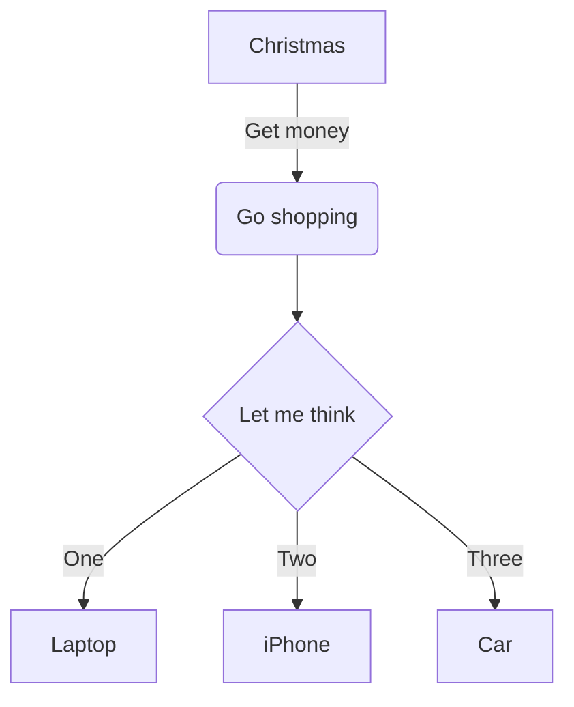

---
tags:
  - syntax
  - how-to
  - guide
  - obsidian
---
```
---
tags:
- tag a
- tag b
---
```
#tags #navigation


#flowchart #diagram

|**Title one**|**2nd title**|**Title 3**|**etc**|
| - | :- | -: | :-: |
|non-indented|left-indented|right indented|centred|
#tables #diagram 

Here's some text! ^sometext
[Here's a link to some text!](Special%20syntax#^sometext)
#links #navigation


